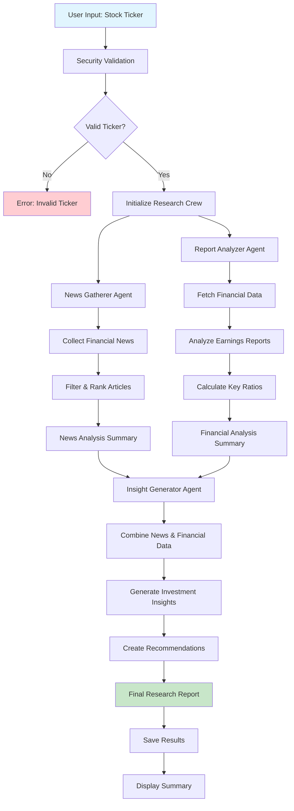

# Automated Investment Research Team

An intelligent investment research system powered by CrewAI that automatically gathers financial news, analyzes reports, and generates comprehensive investment insights.

## 🎯 Project Overview

This system uses multiple specialized AI agents to perform comprehensive investment research:

- **News Gatherer Agent**: Collects and analyzes financial news from multiple sources
- **Report Analyzer Agent**: Analyzes financial reports, earnings data, and company fundamentals  
- **Insight Generator Agent**: Combines all data to generate investment recommendations

## 🔄 System Flowchart



## 🚀 Features

### 🔍 Comprehensive Research
- **Multi-source news gathering** from financial news APIs
- **Financial report analysis** including earnings, balance sheets, and cash flow
- **Technical and fundamental analysis** with key ratios and metrics
- **Sentiment analysis** of news and market sentiment

### 🛡️ Security & Reliability
- **Rate limiting** to prevent API abuse
- **Input validation** and sanitization
- **Error handling** and graceful degradation
- **Secure API key management**

### 📊 Advanced Analytics
- **Valuation analysis** with P/E, P/B ratios
- **Growth trend analysis** and projections
- **Risk assessment** and mitigation strategies
- **Comparative analysis** across multiple stocks

### 🎯 Investment Recommendations
- **Buy/Hold/Sell recommendations** with confidence levels
- **Position sizing suggestions** based on risk profile
- **Time horizon recommendations** for investment strategy
- **Key risks and opportunities** identification

## 📋 Prerequisites

- Python 3.8+
- OpenAI API key
- News API key (optional, for enhanced news gathering)
- Alpha Vantage API key (optional, for additional financial data)

## 🛠️ Installation

1. **Clone the repository**
   ```bash
   git clone <repository-url>
   cd crewAI-Automated_Investment_Research_Team-
   ```

2. **Install dependencies**
   ```bash
   pip install -r requirements.txt
   ```

3. **Set up environment variables**
   ```bash
   cp env_example.txt .env
   ```
   
   Edit `.env` file with your API keys:
   ```env
   OPENAI_API_KEY=your_openai_api_key_here
   NEWS_API_KEY=your_news_api_key_here
   ALPHA_VANTAGE_API_KEY=your_alpha_vantage_api_key_here
   ```

## 🎮 Usage

### Basic Usage

1. **Run the main script**
   ```bash
   python main.py
   ```

2. **Choose research mode**
   - Single stock research
   - Multiple stock comparison
   - Demo mode

### Demo Mode

Run with predefined examples:
```bash
python main.py --demo
```

### Programmatic Usage

```python
from crew.investment_research_crew import InvestmentResearchCrew

# Initialize the research crew
crew = InvestmentResearchCrew()

# Research a single stock
results = crew.research_stock('AAPL')

# Research multiple stocks
results = crew.research_multiple_stocks(['AAPL', 'MSFT', 'GOOGL'])
```

## 📁 Project Structure

```
crewAI-Automated_Investment_Research_Team-/
├── agents/                          # AI Agent modules
│   ├── news_gatherer.py            # News collection agent
│   ├── report_analyzer.py          # Financial analysis agent
│   └── insight_generator.py        # Insight generation agent
├── config/                          # Configuration files
│   └── security.py                 # Security and validation
├── crew/                           # CrewAI orchestration
│   └── investment_research_crew.py # Main crew implementation
├── data/                           # Data storage (created automatically)
├── reports/                        # Generated reports (created automatically)
├── main.py                         # Main execution script
├── requirements.txt                # Python dependencies
├── env_example.txt                # Environment variables template
└── README.md                      # This file
```

## 🔧 Configuration

### Environment Variables

| Variable | Description | Required |
|----------|-------------|----------|
| `OPENAI_API_KEY` | OpenAI API key for LLM access | Yes |
| `NEWS_API_KEY` | News API key for financial news | No |
| `ALPHA_VANTAGE_API_KEY` | Alpha Vantage API key for financial data | No |
| `MAX_REQUESTS_PER_MINUTE` | Rate limiting configuration | No |
| `LOG_LEVEL` | Logging level (INFO, DEBUG, etc.) | No |

### Security Settings

The system includes several security features:

- **Rate limiting**: Prevents API abuse
- **Input validation**: Sanitizes user inputs
- **API key validation**: Ensures valid API keys
- **Error logging**: Tracks security events

## 📊 Output Format

Research results are saved in JSON format with the following structure:

```json
{
  "ticker_symbol": "AAPL",
  "research_date": "2024-01-15T10:30:00",
  "analysis_period": {
    "news_days": 7,
    "financial_period": "1y"
  },
  "crew_results": {
    "news_analysis": {...},
    "financial_analysis": {...},
    "insights": {...}
  },
  "recommendations": [
    "Buy with high confidence",
    "Strong growth prospects"
  ],
  "risks": [
    "Market volatility",
    "Sector headwinds"
  ],
  "opportunities": [
    "Product innovation",
    "Market expansion"
  ]
}
```

## 🛡️ Security Features

### Input Validation
- Ticker symbol format validation
- API key format validation
- Input sanitization to prevent injection attacks

### Rate Limiting
- Configurable request limits per minute
- Automatic throttling to prevent API abuse
- Graceful handling of rate limit exceeded errors

### Error Handling
- Comprehensive error logging
- Graceful degradation when services are unavailable
- Security event tracking

## 🔍 API Dependencies

### Required APIs
- **OpenAI API**: For LLM-powered analysis and insights

### Optional APIs
- **News API**: Enhanced news gathering capabilities
- **Alpha Vantage**: Additional financial data sources
- **Yahoo Finance**: Stock data and financial statements

## 🚨 Limitations

- **API Rate Limits**: Subject to OpenAI and other API rate limits
- **Data Availability**: Depends on availability of financial data
- **Market Hours**: Real-time data only available during market hours
- **Historical Data**: Limited by available historical data sources

## 🤝 Contributing

1. Fork the repository
2. Create a feature branch (`git checkout -b feature/amazing-feature`)
3. Commit your changes (`git commit -m 'Add amazing feature'`)
4. Push to the branch (`git push origin feature/amazing-feature`)
5. Open a Pull Request

## 📝 License

This project is personal open source project

## ⚠️ Disclaimer

This software is for educational and research purposes only. It is not intended to provide financial advice. Always consult with a qualified financial advisor before making investment decisions. The authors are not responsible for any financial losses resulting from the use of this software.

## 🆘 Support

For issues and questions:
1. Check the existing issues
2. Create a new issue with detailed information
3. Include error logs and system information

## 🔄 Updates

- **v1.0.0**: Initial release with basic research capabilities
- **v1.1.0**: Added security features and rate limiting
- **v1.2.0**: Enhanced news gathering and sentiment analysis
- **v1.3.0**: Added comparative analysis and multiple stock research

---

**Built with ❤️ using CrewAI and OpenAI**
